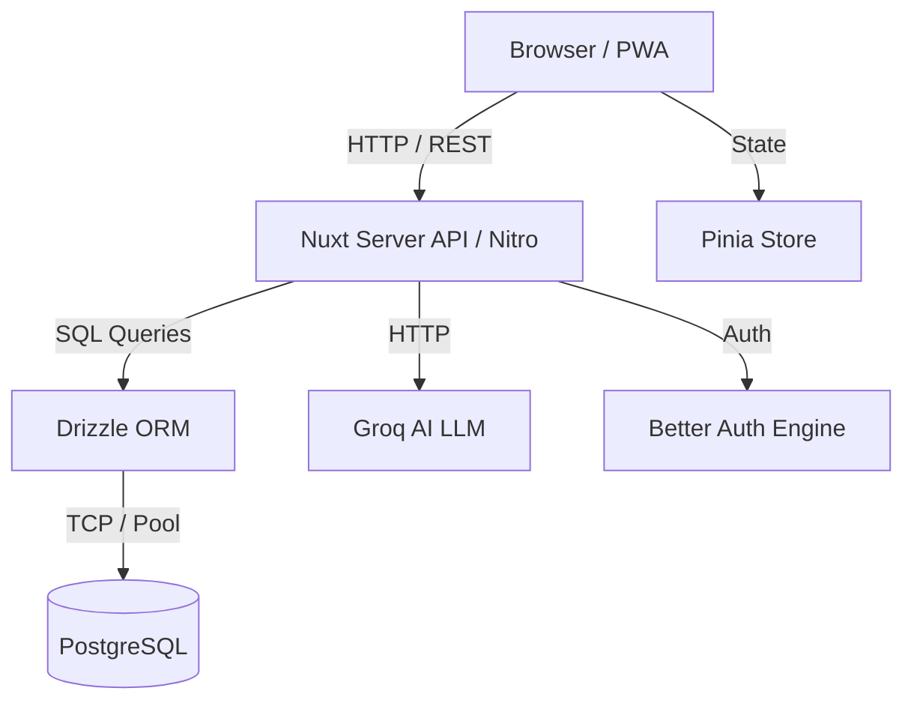

# System Architecture

## 1. High-Level Architecture
Momentum menggunakan arsitektur **Monolith Serverless** dengan Nuxt 4, yang mencakup Frontend (Vue) dan Backend API (Nitro/H3) di dalam satu codebase.



## 2. Frontend Architecture (Nuxt / Vue)
- **Framework**: Nuxt 4 (Vue 3 + Composition API).
- **Styling**: TailwindCSS v4 + Nuxt UI (shadcn-vue).
- **State Management**: 
  - **Pinia**: Menyimpan *state* habit dan *logs* secara lokal untuk mendukung **Optimistic UI**.
  - **VueUse**: Digunakan untuk *utility* seperti `useLocalStorage`, `useNetwork`, dll.
- **Data Fetching**: `useFetch` dan `$fetch` standar bawaan Nuxt.

## 3. Backend Architecture (Nitro / H3)
- **Framework**: Nuxt Server Routes (`/server/api/*`).
- **ORM**: Drizzle ORM. Dipilih karena *type-safe*, sintaks mirip SQL, dan tidak ada overhead *heavy abstraction*.
- **Pattern**: `Controller` (Route Handler) langsung berkomunikasi dengan Drizzle (Tidak perlu *Repository Pattern* untuk MVP ini agar iterasi cepat).

## 4. Data Flow (Optimistic UI Pattern)
Ketika user menceklis habit (Check-in):
1. **UI Layer**: Tombol ditekan, langsung berubah status (hijau).
2. **State Layer (Pinia)**: Log ditambahkan ke memori lokal secara instan.
3. **Background Sync**: `$fetch` dikirim ke `/api/habits/[id]/log` secara *asynchronous*.
4. **Error Handling**: Jika *request* gagal (misal server down), Pinia akan membatalkan *state* (di-revert jadi abu-abu) dan memunculkan notifikasi Toast "Gagal menyimpan".

## 5. Folder Structure
```text
/app
 ├── /components     # UI Components (Dumb/Presentational)
 ├── /pages          # Route pages (Smart Components)
 ├── /composables    # Reusable Vue logic (e.g. useHabits.ts)
 ├── /stores         # Pinia state management
/server
 ├── /api            # H3 Route handlers
 ├── /db             # Drizzle schema & migrations
 ├── /utils          # Server-only utilities
/public              # Static assets
nuxt.config.ts       # Main configuration
```
