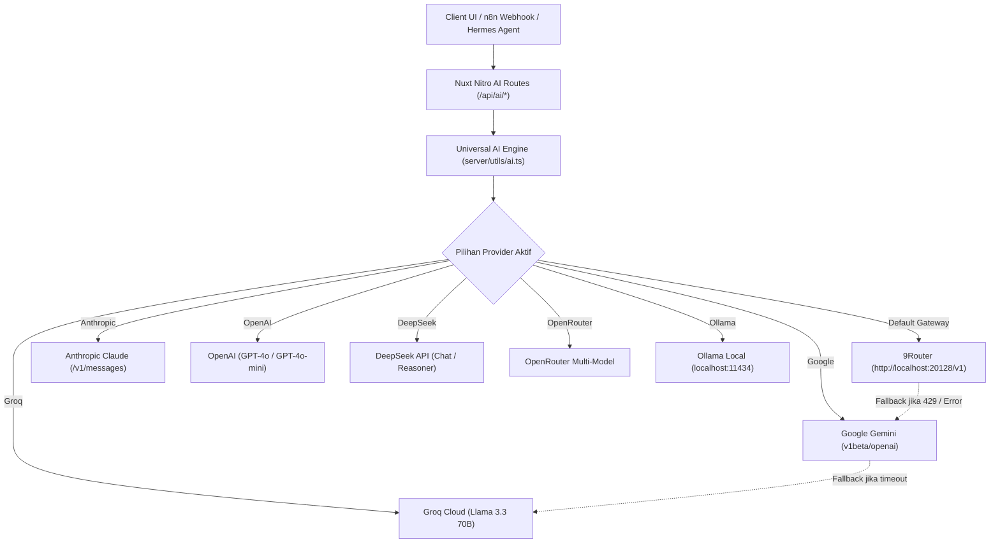

# AI Strategy & Multi-Model Engine

Momentum telah bertransformasi dari sistem yang terikat ke satu vendor (*Groq-only*) menjadi **Universal Multi-Model AI Engine** yang tangguh, fleksibel, dan siap produksi. Sistem ini mendukung **9Router**, model proprietary terkemuka (**Gemini, Claude, GPT, DeepSeek**), open-source providers (**Groq, OpenRouter, Ollama**), serta orkestrasi otomatis via **n8n** dan **Nous Research Hermes Agent**.

---

## 1. Paradigma Baru: Universal Gateway & Vendor Neutrality

Sistem AI Momentum dibangun di atas prinsip:
- **No Single Point of Failure**: Jika kuota provider habis atau terjadi *rate limit* (HTTP 429), sistem secara transparan melakukan *cascading fallback* ke provider alternatif.
- **Local & Cost-Effective First**: Mendukung **9Router** (`http://localhost:20128/v1`) untuk menghemat token secara cerdas dengan *prompt caching* dan perutean hemat biaya.
- **Strict Structured Output**: Generator habit menggunakan validasi skema JSON dengan pembersihan blok kode markdown (`cleanJSONString`).



---

## 2. Portofolio Fitur AI

| Fitur | Endpoint | Deskripsi & Nilai Tambah |
|---|---|---|
| **Magic Habit Generator** | `POST /api/ai/generate-habit` | Membuat kategori habit lengkap dengan 3–5 subtask realistis berdasarkan satu kata kunci (contoh: *"Learn Golang"* atau *"Weight Loss"*). |
| **Weekly Review Analysis** | `POST /api/ai/analyze-week` | Menganalisis log performa 7 hari terakhir, menghitung completion rate, dan memberikan rekomendasi psikologi perilaku (Dopamine-driven feedback). |
| **Daily Motivation Tip** | `POST /api/ai/daily-tip` | Rekomendasi ringkas harian berbasis kebiasaan aktif user untuk menjaga konsistensi harian. |
| **Evening Reflection** | `POST /api/ai/reflection` | Sesi refleksi malam hari untuk mengevaluasi hambatan hari ini dan merancang micro-habits untuk esok hari. |
| **Interactive Cognitive Chat** | `POST /api/ai/chat` | Chatbot asisten konsistensi berbasis cognitive behavioral coaching. |
| **Hermes Agent Telemetry** | `GET /api/agent/habits` | Endpoint telemetry untuk agen otonom Hermes (Nous Research) yang mengekstrak drop-off days, cluster waktu, dan burnout risk. |

---

## 3. Strategi Konfigurasi Provider

Provider default dan model ditentukan melalui variabel lingkungan (environment variables):

```env
# 1. Menggunakan 9Router (Sangat Direkomendasikan untuk Efisiensi Token)
AI_DEFAULT_PROVIDER=gateway
AI_GATEWAY_URL=http://localhost:20128/v1
AI_GATEWAY_KEY=your_gateway_key
AI_DEFAULT_MODEL=gpt-4o-mini

# 2. Atau langsung Google Gemini
AI_DEFAULT_PROVIDER=gemini
GEMINI_API_KEY=AIzaSy...
AI_DEFAULT_MODEL=gemini-2.5-flash

# 3. Atau Anthropic Claude
AI_DEFAULT_PROVIDER=anthropic
ANTHROPIC_API_KEY=sk-ant-...
AI_DEFAULT_MODEL=claude-3-5-haiku-latest

# 4. Atau DeepSeek
AI_DEFAULT_PROVIDER=deepseek
DEEPSEEK_API_KEY=sk-...
AI_DEFAULT_MODEL=deepseek-chat
```

---

## 4. Cascading Fallback & Ketahanan Sistem

Fungsi `executeAICompletionWithFallback` di [`server/utils/ai.ts`](file:///D:/Works/Project/Nuxt.JS/momentum_habit_tracker_plan/server/utils/ai.ts) melakukan:
1. Menjalankan panggilan inferensi ke provider yang diminta (`preferredProvider`).
2. Jika berhasil, hasil dikembalikan beserta metadata provider yang memprosesnya.
3. Jika gagal (misalnya karena `rate limit 429`, `quota exceeded`, atau `timeout`), sistem secara otomatis mencari provider lain yang memiliki API key valid dalam rantai cadangan:
   $$\text{9Router} \longrightarrow \text{Gemini} \longrightarrow \text{Groq} \longrightarrow \text{DeepSeek} \longrightarrow \text{OpenAI} \longrightarrow \text{Anthropic} \longrightarrow \text{Ollama}$$
4. Pengguna tidak akan pernah mendapatkan pesan error 500 selama ada minimal satu provider cadangan yang aktif.

---

## 5. Token Hygiene & Optimalisasi Biaya

- **Pembersihan Log Data**: Input yang dikirim ke AI diringkas dalam bentuk metrik terstruktur (angka persentase, daftar nama kebiasaan, dan rasio penyelesaian) daripada mentah array SQL berukuran besar.
- **Format Output JSON Ketat**: Menggunakan prompt `Respond ONLY in valid JSON. No conversational text or markdown codeblocks.` diikuti pembersihan karakter non-JSON pada parser backend.
- **Event Outbound Caching**: Event disalurkan secara asynchronous via webhook n8n sehingga tidak memblokir respon HTTP pengguna di frontend.
