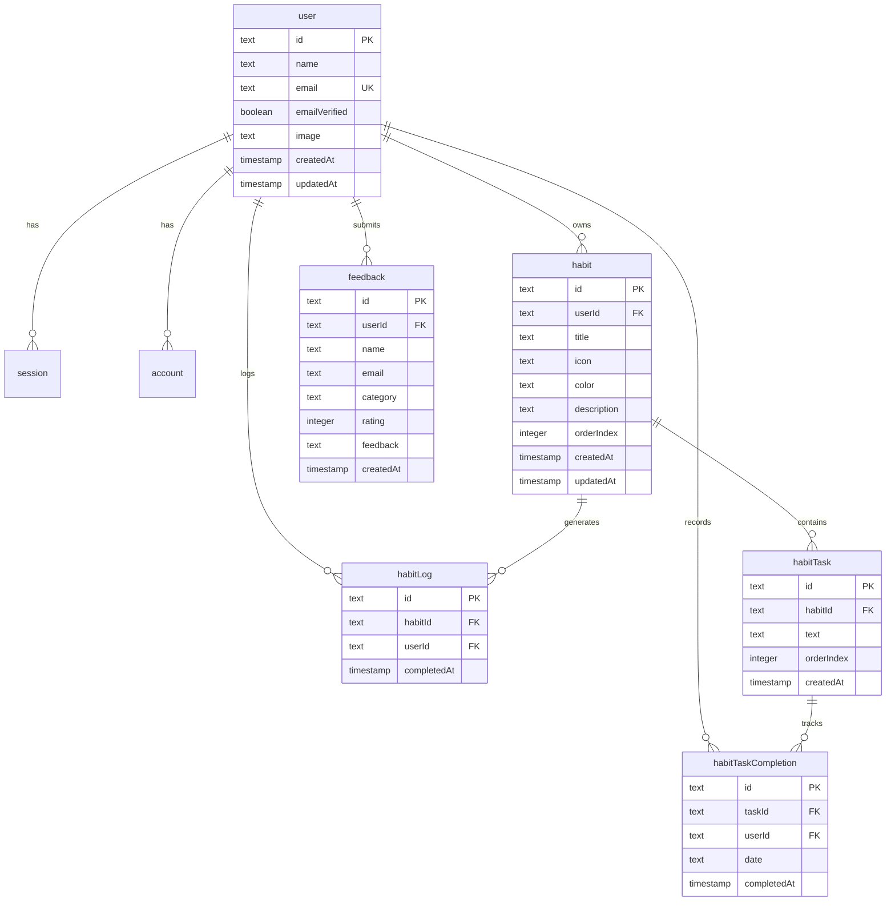

# Database Schema (PostgreSQL + Drizzle ORM)

Momentum menggunakan **PostgreSQL** (didukung oleh Supabase / Neon / Local Postgres) dan diakses secara *type-safe* menggunakan **Drizzle ORM**.

---

## 1. Arsitektur Relasi Database



---

## 2. Definisi Tabel (`server/db/schema.ts`)

### A. Autentikasi (Better Auth Core)

#### `user`
Menyimpan identitas profil pengguna.
- `id` (`text`, PK): ID unik user.
- `name` (`text`): Nama lengkap pengguna.
- `email` (`text`, Unique): Alamat email pengguna.
- `emailVerified` (`boolean`): Status verifikasi email.
- `image` (`text`, nullable): URL avatar pengguna.
- `createdAt` (`timestamp`): Waktu registrasi.
- `updatedAt` (`timestamp`): Waktu pembaharuan profil.

#### `session`
Menyimpan sesi aktif pengguna.
- `id` (`text`, PK)
- `userId` (`text`, FK -> `user.id`): Relasi ke tabel user.
- `token` (`text`, Unique): Token otorisasi sesi.
- `expiresAt` (`timestamp`): Batas kedaluwarsa sesi.
- `ipAddress` (`text`, nullable)
- `userAgent` (`text`, nullable)
- `createdAt` / `updatedAt` (`timestamp`)

#### `account`
Menyimpan kredensial login (Email & Password atau OAuth Google/GitHub).
- `id` (`text`, PK)
- `userId` (`text`, FK -> `user.id`)
- `accountId` (`text`): ID eksternal dari provider OAuth atau email.
- `providerId` (`text`): Contoh `'credential'` atau `'google'`.
- `password` (`text`, nullable): Hash kata sandi untuk akun kredensial.
- `accessToken` / `refreshToken` / `idToken` (`text`, nullable)
- `accessTokenExpiresAt` / `refreshTokenExpiresAt` (`timestamp`, nullable)
- `scope` (`text`, nullable)
- `createdAt` / `updatedAt` (`timestamp`)

#### `verification`
Penyimpanan token verifikasi email dan reset kata sandi.
- `id` (`text`, PK)
- `identifier` (`text`): Email pengguna.
- `value` (`text`): Hash token verifikasi.
- `expiresAt` (`timestamp`): Waktu kadaluwarsa token.
- `createdAt` / `updatedAt` (`timestamp`)

---

### B. Core Habit Tracker & Subtask Engine

#### `habit`
Kategori habit utama milik user.
- `id` (`text`, PK): ID unik habit (dibuat via crypto UUID).
- `userId` (`text`, FK -> `user.id`, `onDelete: 'cascade'`): Pemilik habit.
- `title` (`text`): Nama habit (misal: *"Morning Routine"*, *"Deep Work Coding"*).
- `icon` (`text`): Identifier Iconify/Lucide (misal: `"i-lucide-activity"`).
- `color` (`text`): Kode hex atau nama warna (misal: `"#6366f1"`).
- `description` (`text`, nullable): Catatan atau tujuan habit.
- `orderIndex` (`integer`, default: `0`): Urutan visual saat drag-and-drop.
- `createdAt` (`timestamp`, default: `now()`): Waktu pembuatan.
- `updatedAt` (`timestamp`, default: `now()`): Terakhir diubah.

#### `habitTask`
Sub-rutinitas atau checklist mikro di dalam habit.
- `id` (`text`, PK): ID unik task.
- `habitId` (`text`, FK -> `habit.id`, `onDelete: 'cascade'`): Induk habit.
- `text` (`text`): Judul rutinitas (misal: *"Minum air 500ml"*, *"Push code ke GitHub"*).
- `orderIndex` (`integer`, default: `0`): Urutan urutan di dalam habit.
- `createdAt` (`timestamp`, default: `now()`): Waktu task dibuat.

#### `habitTaskCompletion`
Tabel pencatatan check-in harian untuk setiap subtask (menjadi sumber utama penghitungan Heatmap dan Streak).
- `id` (`text`, PK): ID rekaman penyelesaian.
- `taskId` (`text`, FK -> `habitTask.id`, `onDelete: 'cascade'`): Task yang diselesaikan.
- `userId` (`text`, FK -> `user.id`, `onDelete: 'cascade'`): Pengguna yang menyelesaikan.
- `date` (`text`): Tanggal penyelesaian dalam format ISO string `YYYY-MM-DD` (contoh: `"2026-10-10"`).
- `completedAt` (`timestamp`, default: `now()`): Stempel waktu presisi (jam, menit, detik) saat check-in dilakukan.

#### `habitLog`
Catatan agregasi penyelesaian level habit.
- `id` (`text`, PK)
- `habitId` (`text`, FK -> `habit.id`, `onDelete: 'cascade'`)
- `userId` (`text`, FK -> `user.id`, `onDelete: 'cascade'`)
- `completedAt` (`timestamp`, default: `now()`)

---

### C. Feedback & App Telemetry

#### `feedback`
Umpan balik dan penilaian dari pengguna aplikasi.
- `id` (`text`, PK)
- `userId` (`text`, nullable, FK -> `user.id`, `onDelete: 'set null'`)
- `name` (`text`): Nama pengirim feedback.
- `email` (`text`): Email pengirim feedback.
- `category` (`text`): Kategori (misal: `"bug"`, `"feature"`, `"ui"`).
- `rating` (`integer`): Nilai 1 - 5 bintang.
- `feedback` (`text`): Isi pesan/keluhan/saran.
- `createdAt` (`timestamp`, default: `now()`)

---

## 3. Skrip Perintah Database (Drizzle Kit)

```bash
# Membuat file migrasi dari schema.ts
bun run db:generate

# Mengaplikasikan perubahan skema langsung ke database Postgres
bun run db:push

# Membuka GUI interaktif Drizzle Studio di browser
bun run db:studio
```
